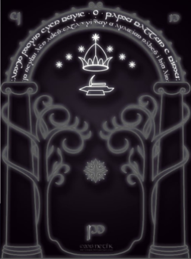
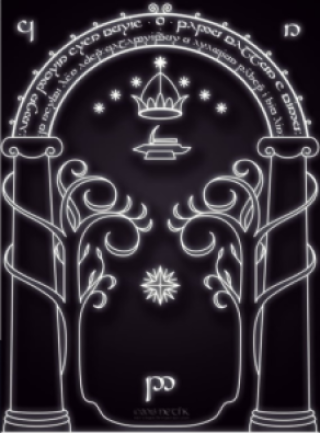

# Краткая инструкция:
 
* Чтобы решить эту задачку, нам необходимо решить загадку, которая в описании
* Попробуем узнать откуда взяты эти слова и находим фильм властелин колец
```
В верхней части рисунка располагалась арка с надписью на Синдарине, выполненной Тенгваром. 
В надписи содержался пароль для открытия Врат:

Ennyn Durin Aran Moria: pedo mellon a minno.
Im Narvi hain echant: Celebrimbor o Eregion teithant i thiw hin.


Двери Дурина, Государя Мориа. Скажи «друг» и войди.
Я, Нарви, сделал их. Келебримбор из Эрегиона начертал эти знаки.
```
* Решение загадки состоит в произнесении слова mellon
* Открываем приложение и видим ворота
  
* В середине ворот изображена восьмиконечная звезда, при наведении на которую ворота загораются
  
* При нажатии на эту звезда появляется значок микрофона
* Проговариваем слово mellon
* Находим флаг
  