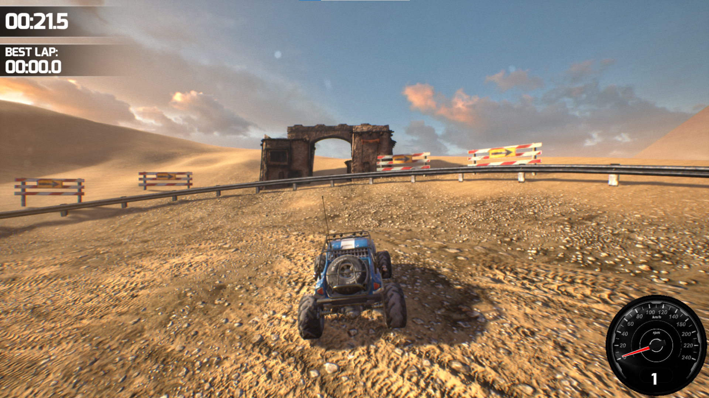
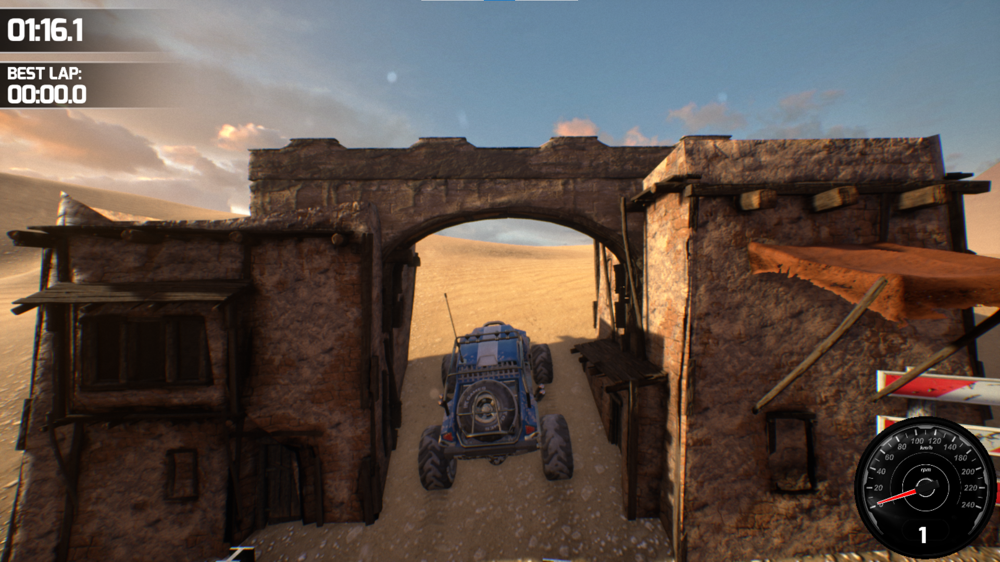
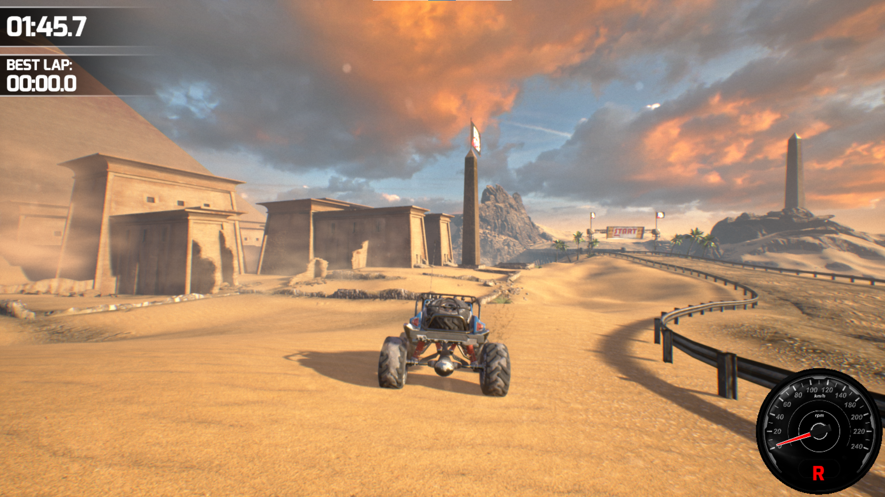
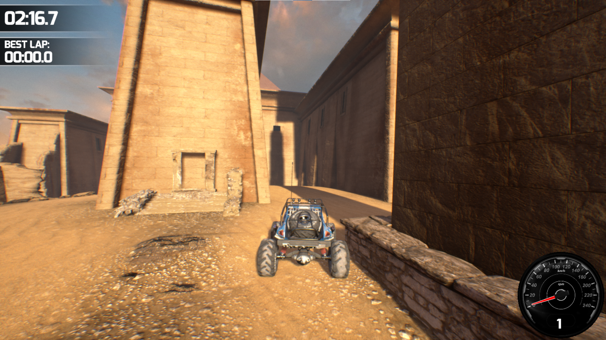
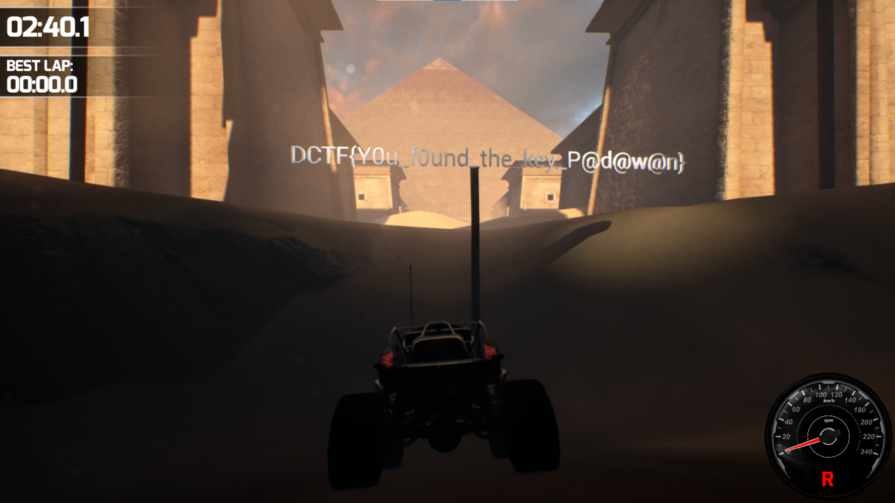

# Краткая инструкция:
 
* Чтобы решить эту задачку, нам необходимо решить загадку, которая в описании
* Попробуем узнать откуда взяты эти слова и находим фильм первому игроку приготовиться
```
  Первым испытанием является непроходимая гонка, забитая кучей препятствий и ловушек. 
  Для прохождения испытания и получения первого ключа необходимо занять первую позицию в гонке. 
  Непроходимой она является потому, что в конце, прямо перед финишем, путь всегда преграждает Кинг-Конг, 
  который уничтожает любого, попытавшегося пройти мимо него.

  В один день, Парсифаль, просматривая видеозапись "Gregarious Games, Корпоратив, 2029 год" в Альманахе Анорака услышал монолог Холлидея: 
  "Почему нельзя двигаться назад... в кой-то веке? Двигаться обратно, очень быстро, насколько возможно. Выжать педаль в пол назад. 
  Билл и Тед так сделали" и понял, что чтобы победить в гонке, нужно ехать не вперёд, а назад на полной скорости.
```
* Заходим в игру и пробуем поехать в обратную сторону
* Видим, какой-то вход 
  
* Пробуем в него заехать и у нас получается
  
* Далее едем к обелиску с флагом
  
* Попытаемся заехать в место, куда падает тень
  
* Находим флаг
  