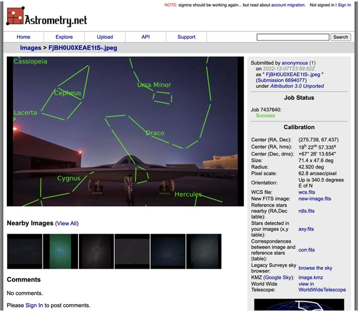
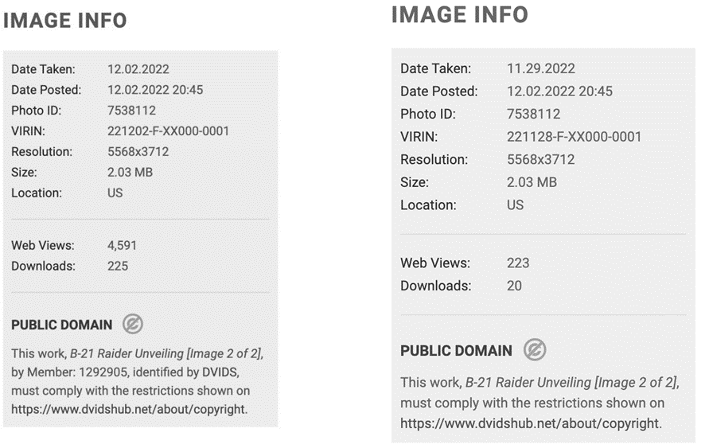
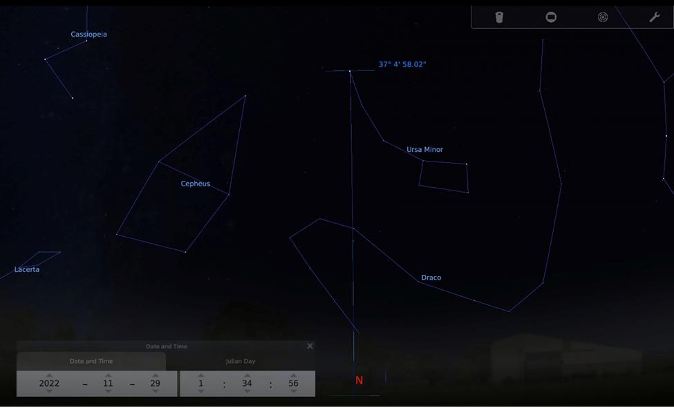
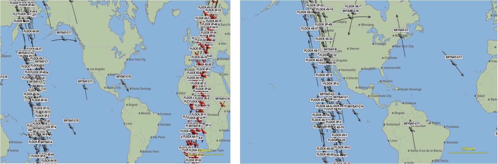
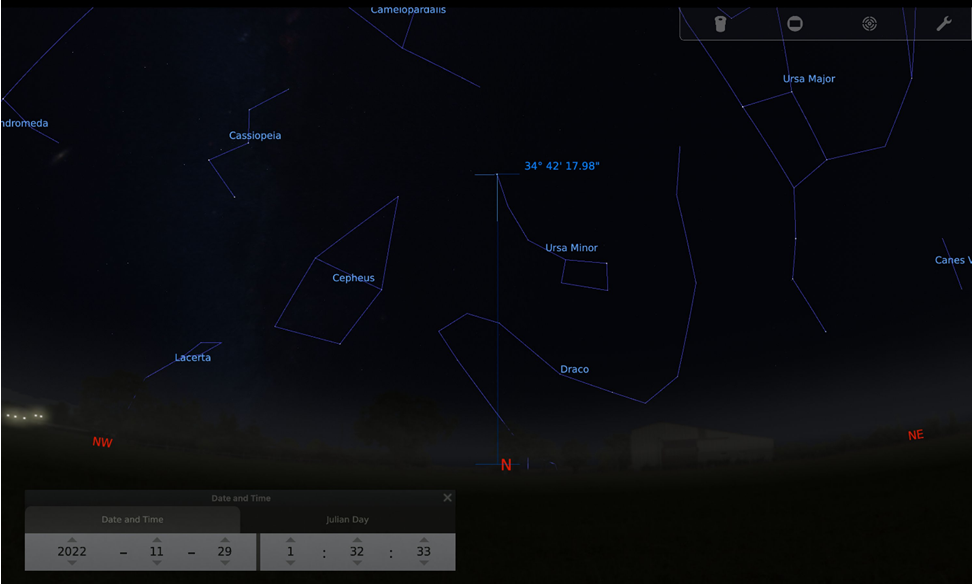
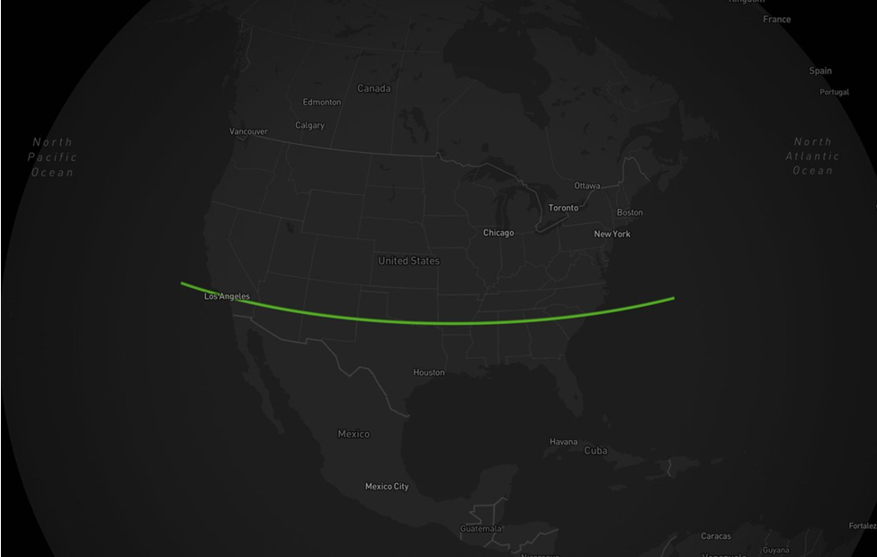
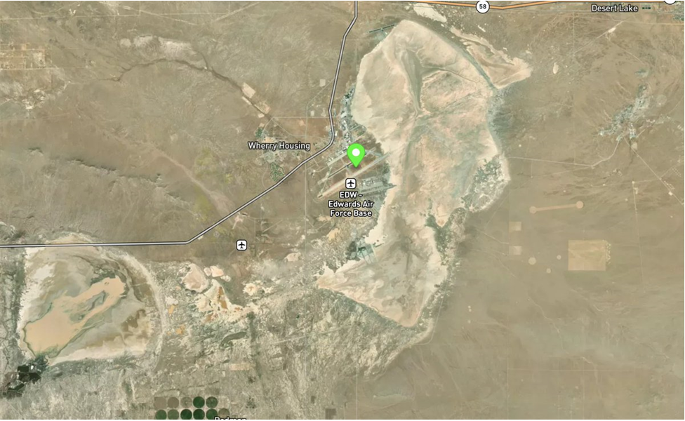
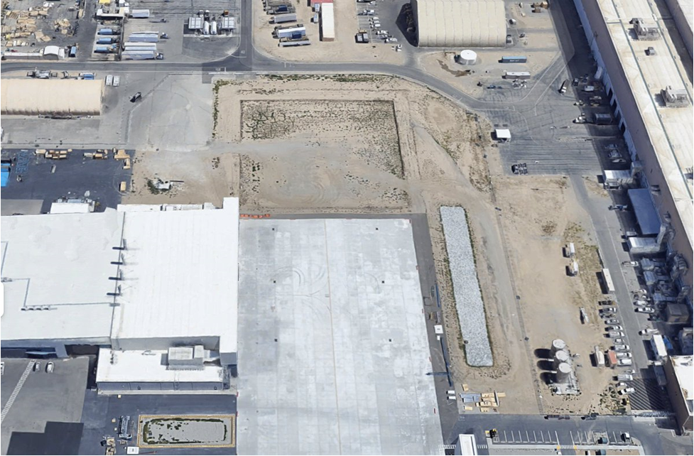

# Краткая инструкция:
 
* Даётся фото самолёта
  
* Astrometry.net позволит нам загрузить фотографию и нарисовать соответствующие созвездия. 
* Также дает нам кучу файлов звездных карт, которые мы можем использовать позже
  
* На исходном веб-сайте изображения у нас есть некоторые метаданные, такие как дата съемки. 
* Однако спустя время он был удален, вероятно, после того, как осознали свою ошибку,
* Но используем Waybackmachine, чтобы получить дату оригинала (справа)
  
* Импортируя нашу карту звездного неба в Stellarium и дату, 
* мы можем получить визуализацию, которая очень хорошо совпадет с нашим исходным изображением. 
* Исходя из этого, совместив углы созвездия с горизонтом, мы можем оценить время, когда была сделана фотография - 1:30 ночи
  
* 1:30 утра — прекрасное время, чтобы выкатить самолет-невидимку из его ангара, 
* когда количество спутников для съемки над США минимально (слева). 
* По сравнению с более поздним днем (справа)  
  
* Мы знаем, что угол между северной звездой и горизонтом даст нам приблизительную широту того места, 
* где стоит наблюдатель. Это выходит между 34/35 градусов
  
* Предположим, что это место находится где-то в пределах США, поэтому мы можем провести линию по широте 34 градуса через всю страну. 
* Баз ВВС США куча по всей стране, но не многие пересекают линию
  
* Исторически сложилось так, что большинство самолетов-невидимок в США строятся в Калифорнии, и мы знаем, 
* что этот самолет построен компанией Northrop Grumman, которая также в основном разрабатывает свои самолеты там. 
* Сужая наш поиск до CA, мы находим только одну базу, которая пересекается - авиабаза Эдвардс
  
* У Northrop Grumman не так много заводов по разработке в Эдвардсе, но они есть в 30 милях к югу в региональном аэропорту Палмдейл. 
* Там же разрабатывали самолет В-2. Один виден из представления Google Maps
  
* Итак, теперь мы знаем, что это изображение B-21 компании Northrop Grumman, 
* сделанное примерно в 1:30 ночи 29 ноября 2022 года на заводе ВВС 42 (34.6399, -118.0744) или (34.6294, -118.0844)